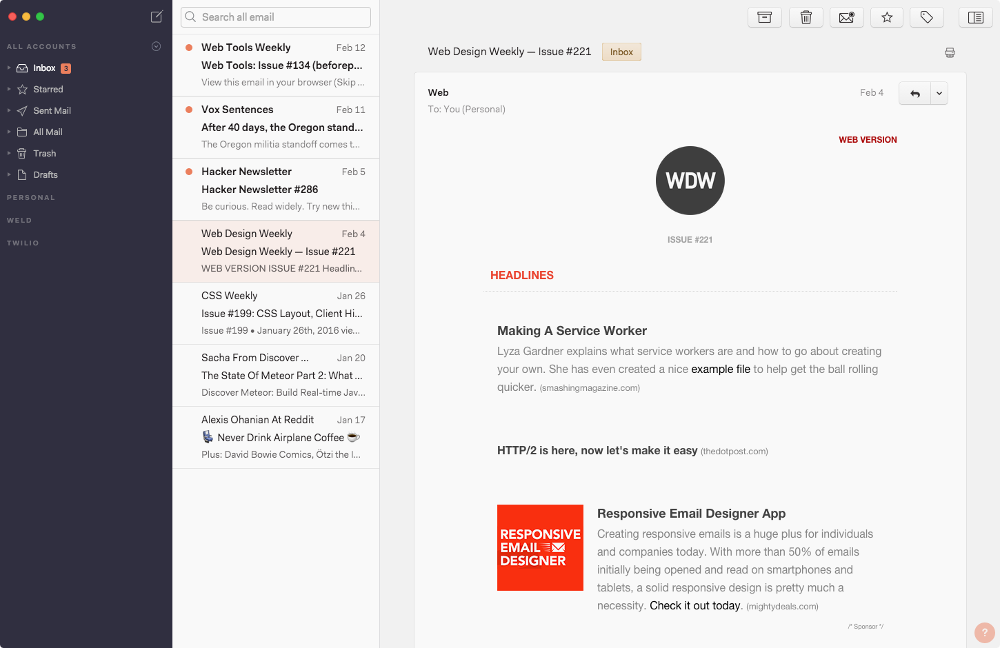

# Darkside
A customizable, dark sidebar theme for [Nylas N1](https://nylas.com/n1).

[](./examples/default.png)

[See other example themes →](http://jamiewilson.io/darkside)

## Installation

[](https://github.com/jamiewilson/darkside/archive/master.zip)

##### Step 1
Unzip `darkside-master.zip`.

##### Step 2
Open the Nylas N1 Preferences panel with <kbd>⌘,</kbd> or `Nylas N1 > Preferences` and choose `Install a theme…` from the `Select Theme` dropdown.


##### Step 3
Select the `darkside-master` folder and press `Open`. N1 will make a copy of the theme files into your `packages` directory, notify you that the theme has been installed, and open the new folder in a new Finder window.

##### Step 4
To customize Darkside, open `darkside/styles/darkside.less` in a text editor.

**To change colors, just comment out the default `@sidebar` and `@accent` variables and uncomment another theme or simply replace with your own colors.**

```sass
// Default
@sidebar: #313042;
@accent: #F18260;

// Luna
// @sidebar: #202C46;
// @accent: #39DFF8;

// Zond
// @sidebar: #333333;
// @accent: #F6D49C;

// Gemini
// @sidebar: #00203C;
// @accent: #F6B312;

// Mercury
// @sidebar: #555;
// @accent: #999;

// Apollo
// @sidebar: #3A1E15;
// @accent: #F6AA1C;
```
